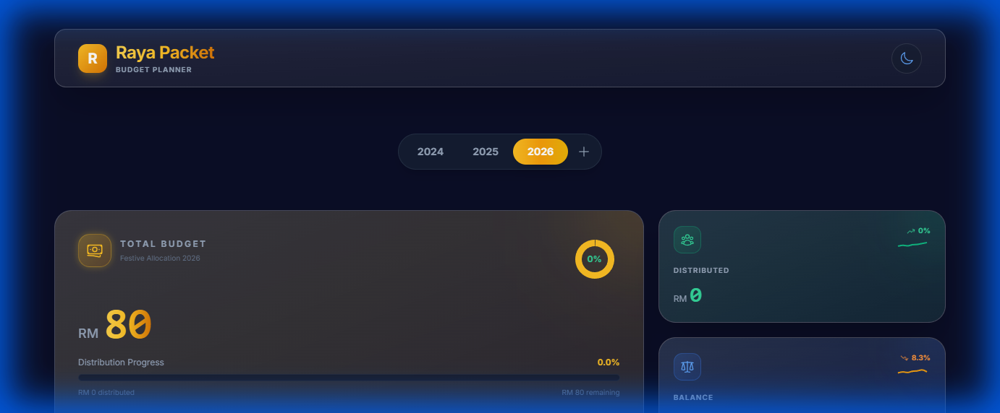

# Raya Packet Budget Planner 🌙✨

A modern, premium Digital Budget Planner for tracking festive money packets (Duit Raya). Built with a focus on beautiful UI/UX, family management, and year-over-year tracking.



## ✨ Features

- **Dashboard Overview**: Track Total Budget, Distributed Amounts, and Balance in real-time.
- **Yearly Organization**: seamless switching between years (e.g., 2025, 2026) to manage historical data.
- **Family & Individual Management**:
  - Add "Factories" (Families with kids) or Single Individuals (Elderly/Relatives).
  - Auto-calculation of total cash needed based on kid count and rate.
- **Smart Analytics**:
  - **Cash Notes Breakdown**: Tells you exactly how many RM1, RM5, RM10, etc. notes you need to withdraw.
  - **Yearly Comparison**: Bar chart comparing budget performance across years.
- **Premium UI**: Glassmorphism design, staggered animations, mobile-first responsive layout, and Dark/Light mode support.

## 🛠 Tech Stack

- **Frontend**: React, Vite, Tailwind CSS, Framer Motion, Recharts.
- **Backend**: Node.js, Express.js.
- **Database**: SQLite (Stored locally in `server/database.db`).

---

## 🚀 Getting Started

### Prerequisites

- Node.js (v18 or higher recommended).

### 1. Installation

Clone the repository and install dependencies for both client and server.

```bash
# 1. Install Client Dependencies
cd client
npm install

# 2. Install Server Dependencies
cd ../server
npm install
```

### 2. Running Locally (Development)

You need to run **two terminals** for full development experience (Hot Reloading).

**Terminal 1: Backend Server**

```bash
cd server
npm run dev
# Server runs on http://localhost:3000
```

**Terminal 2: Frontend Client**

```bash
cd client
npm run dev
# Client runs on http://localhost:5173
```

Access the app at `http://localhost:5173`. Make sure port 3000 is free for the API.

---

## 🌍 How to Deploy

This application is configured to be deployed as a **single unit** (Node.js serving React static files).

### Step 1: Build the Frontend

Generate the optimized static files for production.

```bash
cd client
npm run build
```

_This creates a `dist` folder in `client/dist`._

### Step 2: Run the Server (Production)

The server is configured to serve the files from `client/dist` automatically.

```bash
cd server
npm start
```

### Step 3: Access

The application will be available at:
`http://localhost:3000` (or your server's IP address)

### Recommended Hosting Options

1.  **VPS (DigitalOcean/EC2) - Recommended**:
    - Upload the project.
    - Run `npm run build` in `client`.
    - Run `npx prisma migrate deploy` in `server` to initialize/update the production DB.
    - Use `pm2` to keep `server/index.js` running.
    - Use Nginx as a reverse proxy.
2.  **Render/Railway/Heroku**:
    - **Important**: SQLite requires a persistent disk. If using ephemeral file systems (like standard Heroku/Render), your data will be lost on restart. ensure you mount a volume.
    - Add a build command to install dependencies and build the client.
    - Add a start command: `npx prisma migrate deploy && node index.js`.

### Post-Deployment Setup (Admin Access)

After deploying to production, the database will be fresh (or updated). You must manually assign the admin role to your user:

1.  Register a user account in the live app.
2.  Access the server (SSH or Console).
3.  Open the database:
    ```bash
    cd server
    sqlite3 database.db "UPDATE users SET is_admin=1 WHERE email='your@email.com';"
    ```
4.  Log out and log back in to see the Admin features.

---

## 🔒 Security Note

- **Database**: The `database.db` file contains sensitive financial/personal data. **DO NOT commit this file to public repositories.**
- **.gitignore**: The project is pre-configured to ignore `*.db` files. Back up your database manually if needed.

## 📂 Project Structure

```
do-itraya/
├── client/           # React Frontend
│   ├── src/
│   ├── dist/         # Build output (after npm run build)
│   └── ...
├── server/           # Node Backend
│   ├── database.js   # SQLite connection & schema
│   ├── index.js      # Express API & Static Server
│   └── ...
└── README.md
```
